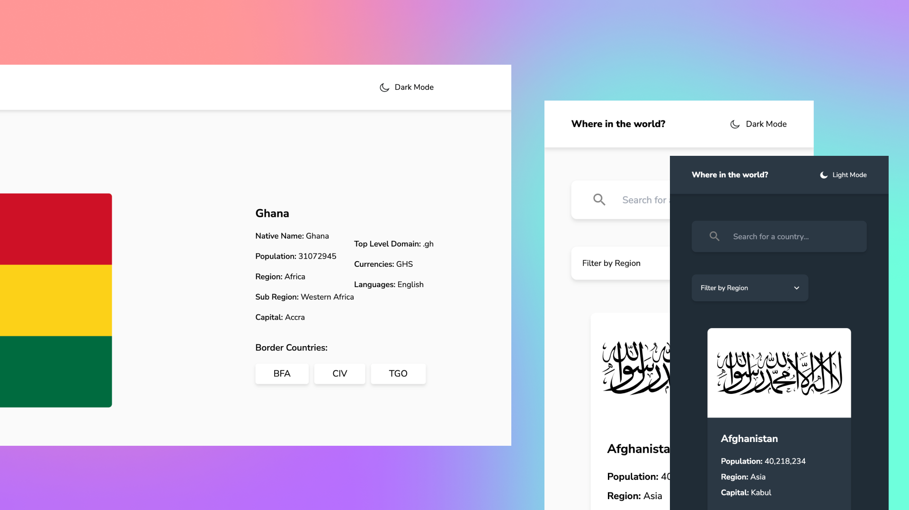

# REST Countries API

A React application that implements the REST principles to pull data about countries and displays them in a presentable fashion.

## Table of contents

- [Overview](#overview)
  - [The challenge](#the-challenge)
  - [Screenshot](#screenshot)
  - [Links](#links)
- [My process](#my-process)
  - [Built with](#built-with)
  - [What I learned](#what-i-learned)
  - [Useful resources](#useful-resources)

**Note: Delete this note and update the table of contents based on what sections you keep.**

## Overview

### The challenge

Users should be able to:

- View the optimal layout for the app depending on their device's screen size
- See all countries from the API on the homepage
- Search for a country using an input field
- Filter countries by region
- Click on a country to see more detailed information on a separate page
- Click through to the border countries on the detail page
- Toggle the colour scheme between light and dark mode

### Screenshot

### Links

- Solution URL: [Github](https://github.com/larbiDanquah/rest-countries-api)
- Live Site URL: [Netlify](https://your-live-site-url.com)

## My process

### Built with

- [React](https://reactjs.org/) - JS library
- [Typescript](https://www.typescriptlang.org/)
- [Tailwindcss](https://tailwindcss.com/) - For styles

### What I learned

I learned how to build an application with React and TypeScript. I also learnt how to manage state with Redux in a React application.

### Useful resources

- [Tailwindcss](https://tailwindcss.com/) ) - This helped me for as I was styling the components. It helped me save time on writing css and allowed me to focus on the logic of the application.
